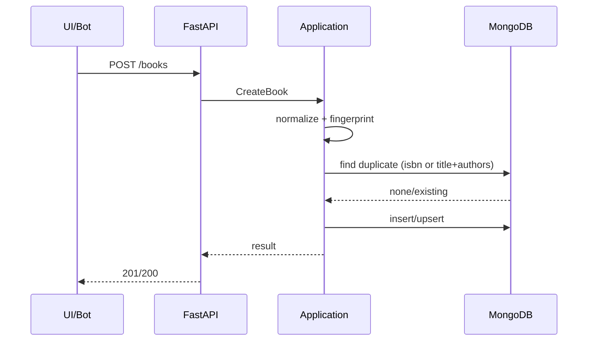
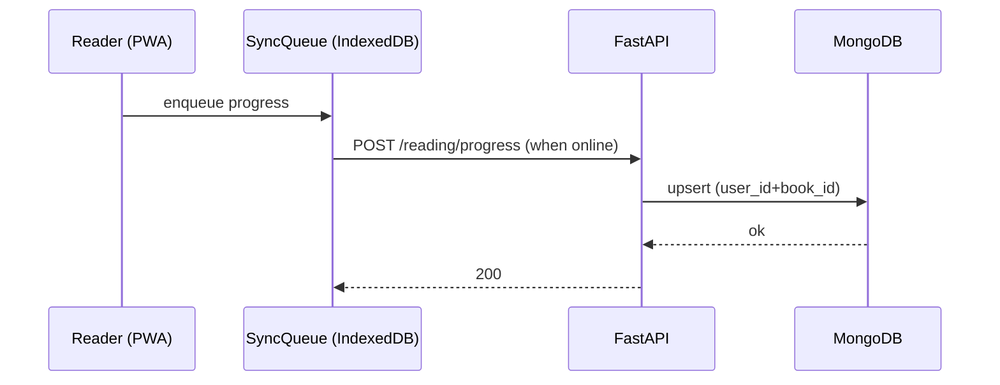

# Fluxos (Mermaid)

## Criar Livro (dedupe + persist)

```mermaid
sequenceDiagram
    participant UI as UI/Bot
    participant API as FastAPI
    participant APP as Application
    participant DB as MongoDB

    UI->>API: POST /books
    API->>APP: CreateBook
    APP->>APP: normalize + fingerprint
    APP->>DB: find duplicate (isbn or title+authors)
    DB-->>APP: none/existing
    APP->>DB: insert/upsert
    APP-->>API: result
    API-->>UI: 201/200
```

## Atualizar Progresso (offline sync)

```mermaid
sequenceDiagram
    participant Reader as Reader (PWA)
    participant Queue as SyncQueue (IndexedDB)
    participant API as FastAPI
    participant DB as MongoDB

    Reader->>Queue: enqueue progress
    Queue->>API: POST /reading/progress (when online)
    API->>DB: upsert (user_id+book_id)
    DB-->>API: ok
    API-->>Queue: 200
```
